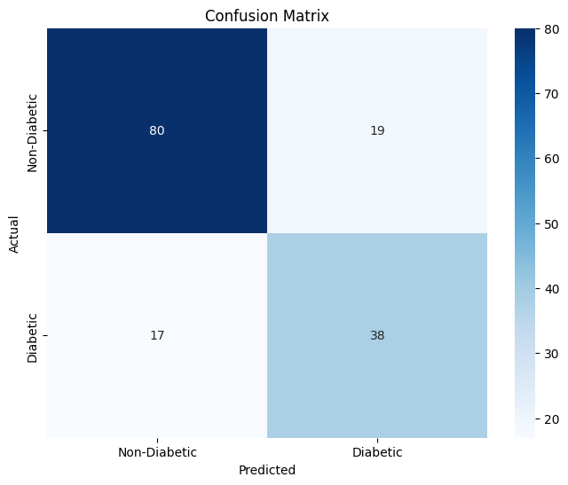
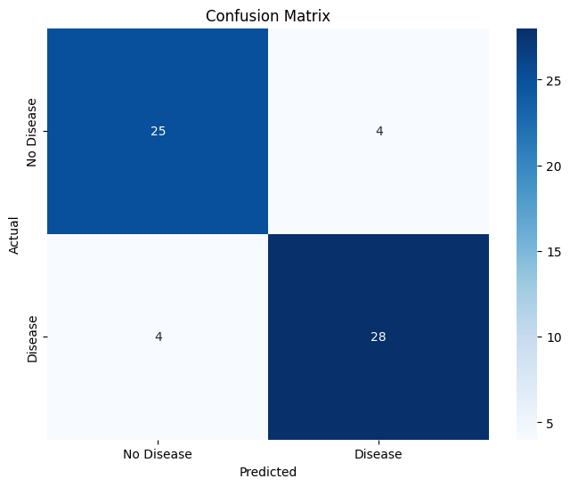
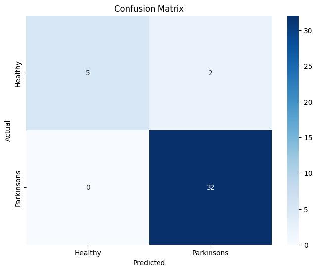
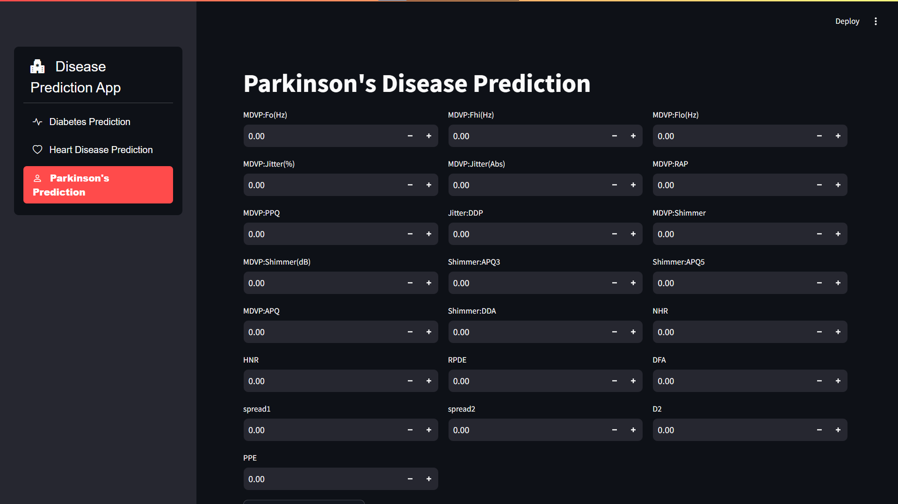
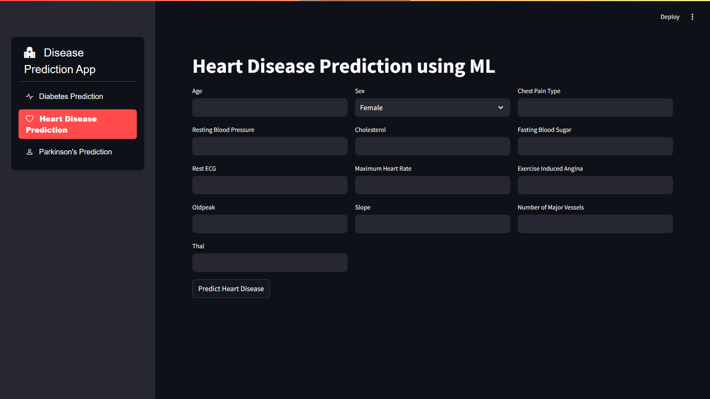
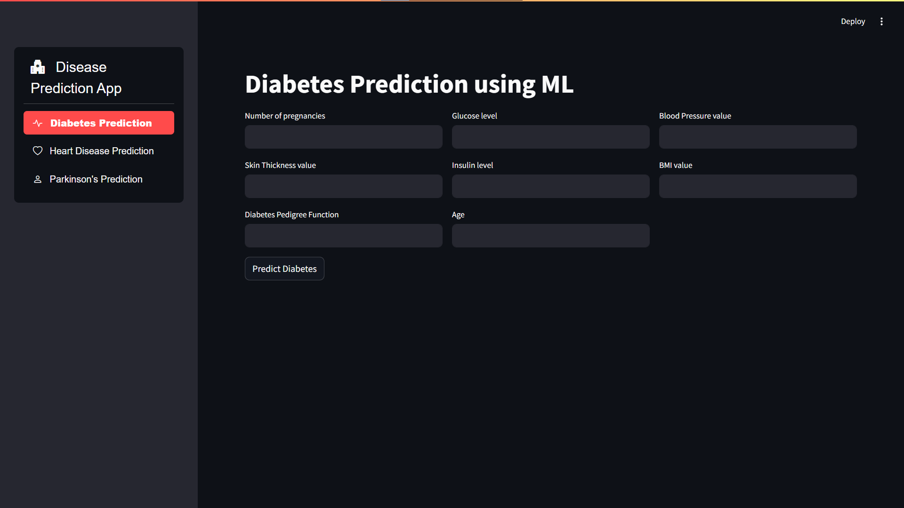

# Disease Prediction Models
## Edunet Foundation | Shell | Artificial Intelligence with Green Technology | 4-weeks Virtual Internship 


## Table of contents

- [Overview](#overview)
- [Built with](#built-with)
- [Installation](#installation)
- [About Models](#about)
- [Result Analysis](#resultanalysis)
- [Feature](#features)
- [Author](#author)


## Overview
- The primary objective of this project is to develop machine learning models for the early detection of
three significant diseases: Diabetes, Heart Disease, and Parkinson’s Disease. By leveraging these models,
healthcare providers and individuals can identify potential health issues early, enabling timely
intervention and treatment. The models were trained on publicly available datasets, utilizing advanced
classification algorithms to achieve high prediction accuracy.

## Built with

- ### Programming Language used
    - Python

- ### Framework Used
    - Streamlit

- ### Libraries
  - `pandas`, `numpy`: Data manipulation and numerical operations.
  - `scikit-learn`: Model training, hyperparameter tuning, and evaluation.
  - `matplotlib`, `seaborn`: Data visualization.
  - `pickle`: Model serialization.
3.2 models (text and vision)


## Installation

### Prerequirements
  - `python 3.12`

### Installation steps

  ```
    git clone https://github.com/dineshdhayfule/Prediction-of-Disease.git
    cd Prediction-of-Disease
  ```
  ```
  pip install -r requirements.txt
  ```

  - Execute each commands in a seperate terminal
  ```
  stremlit run app.py
  ```
  - Open ` http://127.0.0.1:8501` in your browser


## About Model

- ### Diabetes Prediction Model:
    - **Dataset:** Contains features like glucose levels, BMI, age, and number of pregnancies.
    - **Preprocessing:** Replacing missing values with column means.
    - **Model Training:** Random Forest Classifier with grid search for hyperparameter tuning.
    - **Evaluation:** Achieved an accuracy of ~90%. Confusion matrix and classification report highlight
    predictive performance.
    - **Output:** Predictions on test data and a saved model (diabetes_model.pkl).

- ### Heart Disease Prediction Model:
    - **Dataset:** Includes medical metrics such as cholesterol levels, resting blood pressure, and
    maximum heart rate.
    - **Preprocessing:** Handled missing values and normalized features.
    - **Model Training:** Random Forest Classifier with extensive hyperparameter tuning.
    - **Evaluation:** Model accuracy reached 86.68%. Confusion matrix reveals reliable disease
    detection.
    - **Output:** Predictions on sample inputs and a saved model (heart_disease_model.pkl)

- ### Parkinson's Disease Prediction Model:
    - **Dataset:** Consists of vocal measurements such as jitter, shimmer, and pitch variation.
    - **Preprocessing:** Dropped irrelevant columns (e.g., name) and handled missing values.
    - **Model Training:** Random Forest Classifier tuned for precision in binary classification (healthy vs.
    Parkinson’s).
    - **Evaluation:** Delivered an accuracy of 94%. Visualized confusion matrix and reported
    performance metrics.
    - **Output:** Predictions on real-world scenarios and a saved model (parkinsons_disease_model.pkl).


## Result Analysis

- ### Diabetes Prediction Model:
    

- ### Heart Disease Prediction Model:
    


- ### Parkinson's Disease Prediction Model:
    


## Website Overview
  - ### Parkinsons Disease Prediction
    

  - ### Heart Disease Prediction
    

  - ### Diabetes Prediction
    
    


## Deployed on streamlit

- Click [here](https://disease-detector-ai.streamlit.app/)


## Author

- dineshdhayfule - Contact Gmail [dinesh71828@gmail.com]()

